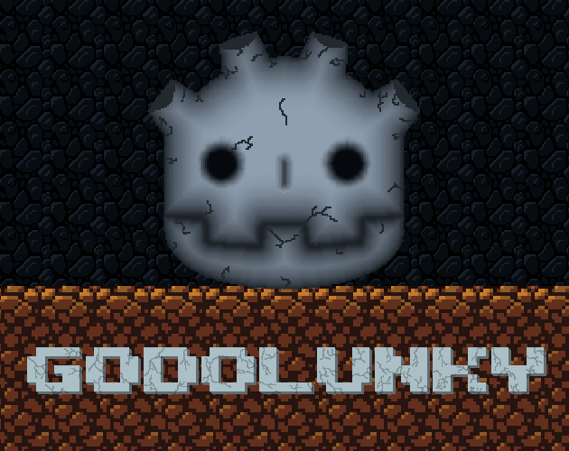
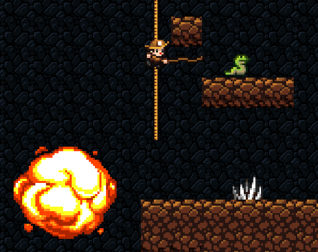

# Godotlunky
A clone of Spelunky Classic built in Godot

# About
A clone of Spelunky made to learn Godot and practice c++ w/GDNative. All the code is original, most of the art and sounds are from Spelunky Classic by Derek Yu. Build available at https://cha5m.itch.io/godolunky
